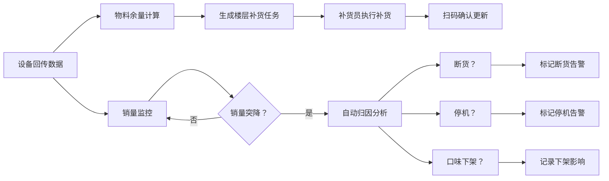

## 1. 产品概述

写字楼咖啡机补货管理系统，用于管理楼宇内多楼层分布的智能咖啡机设备日常运营。系统通过每日设备回传的物料数据（豆仓、奶盒、水箱、杯子存量）和故障码，实现按楼层的智能补货调度，并通过销量异常分析区分断货、停机、口味下架三种原因，帮助运营团队高效管理设备补给与运维。

目标用户为运营管理者、补货员、运维工程师。

## 2. 核心功能

### 2.1 用户角色

| 角色 | 注册方式 | 核心权限 |
|------|-----------|----------|
| 运营管理员 | 系统账号 | 查看全局数据、配置补货策略、管理口味上下架 |
| 补货员 | 系统账号 | 查看楼层补货任务、执行补货、上报异常 |
| 运维工程师 | 系统账号 | 处理设备故障、维护设备信息 |

### 2.2 功能模块

1. **仪表盘总览：设备状态概览、库存预警、今日补货任务、销量趋势
2. **设备管理：设备列表、实时状态、历史数据、故障记录
3. **补货管理：楼层补货任务、补货执行记录、补货历史
4. **销量分析：销量趋势、异常检测、原因分类（断货/停机/口味下架）
5. **口味管理：产品列表、上下架管理、销量统计
6. **系统设置：楼宇楼层配置、预警阈值设置

### 2.3 页面详情

| 页面名称 | 模块名称 | 功能描述 |
|-----------|-----------|----------|
| 仪表盘 | 状态概览 | 设备在线/离线统计、各楼层物料预警卡片 |
| 仪表盘 | 补货任务 | 今日待补楼层列表、任务状态追踪 |
| 仪表盘 | 销量趋势 | 近7天销量折线图、异常标记 |
| 仪表盘 | 异常告警 | 待处理故障、销量异常设备列表 |
| 设备管理 | 设备列表 | 楼层筛选、设备状态、物料余量、故障码显示 |
| 设备管理 | 设备详情 | 历史数据趋势、故障记录、物料消耗曲线 |
| 补货管理 | 补货任务 | 按楼层生成的每日补货清单、物料需求计算 |
| 补货管理 | 补货执行 | 扫码确认、补货量录入、异常上报 |
| 补货管理 | 补货历史 | 按楼层/时间的补货记录查询 |
| 销量分析 | 销量趋势 | 多维度销量统计（楼层/设备/口味） |
| 销量分析 | 异常分析 | 销量突降检测、自动归因（断货/停机/下架）、人工确认 |
| 口味管理 | 产品列表 | SKU管理、上下架操作、销售占比 |
| 口味管理 | 下架分析 | 口味下架后的销量影响评估 |
| 系统设置 | 楼宇配置 | 楼层、设备位置配置 |
| 系统设置 | 阈值配置 | 物料预警阈值、销量异常阈值 |

## 3. 核心流程

每日运营流程：设备每日定时回传豆仓、奶盒、水箱、杯子余量及故障码 → 系统自动计算各楼层补货需求 → 生成补货任务 → 补货员领取任务并执行 → 完成后扫码确认 → 系统更新设备物料数据 → 持续监控销量，当设备销量突降时，系统结合物料数据、故障状态、口味上下架记录进行自动归因，辅助运营决策。

## 4. 用户界面设计

### 4.1 设计风格

采用工业风+现代科技感，体现专业管理系统的稳重与高效。
- **主色调**：深海军蓝 #0F2B4A，体现专业稳重
- **辅助色**：科技蓝 #3B82F6 用于主要操作按钮
- **告警色**：橙色 #F59E0B 预警，红色 #EF4444 紧急告警
- **成功色**：绿色 #10B981 正常状态
- **字体**：系统字体
- **布局**：侧边导航 + 卡片式内容区
- **按钮风格**：直角硬朗风格，带轻微阴影
- **图标风格**：线性简洁图标

### 4.2 页面设计概览

| 页面名称 | 模块名称 | UI元素 |
|-----------|-----------|--------|
| 仪表盘 | 状态概览 | 大数字统计卡片、进度条显示物料余量、色块区分状态 |
| 仪表盘 | 补货任务 | 表格列表、状态标签、优先级标识 |
| 仪表盘 | 销量趋势 | 面积图、异常点红色标记、悬停详情 |
| 设备管理 | 设备列表 | 卡片网格布局、楼层筛选、状态徽章 |
| 设备管理 | 设备详情 | 多标签页、趋势折线图、时间轴故障记录 |
| 补货管理 | 补货任务 | 楼层分组、物料清单、进度指示 |
| 销量分析 | 异常分析 | 归因流程图、三种原因分类卡片、可交互详情 |
| 口味管理 | 产品列表 | 卡片布局、上下架开关、销量占比环形图 |

### 4.3 响应式

桌面端优先设计，适配 1440px、1920px 等常见管理后台分辨率，移动端自适应。侧边栏可折叠。表格支持水平滚动。

### 4.4 交互设计

- 页面加载采用骨架屏动画
- 数据更新采用淡入效果
- 状态切换采用平滑过渡
- 告警采用脉冲动画提醒
- 按钮悬停采用轻微上浮+阴影加深
