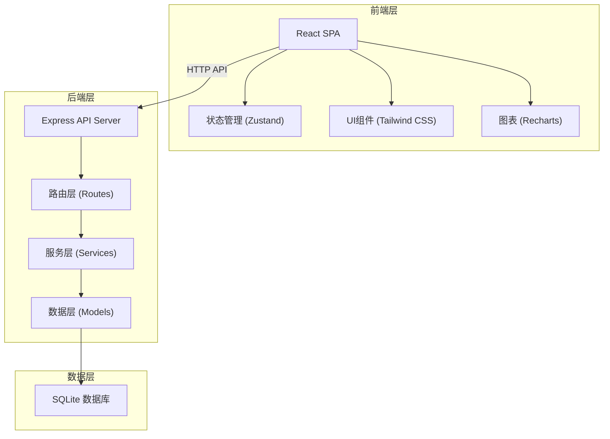
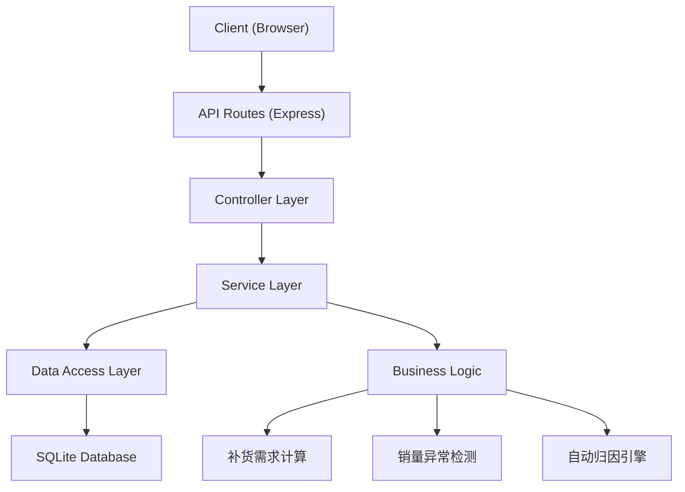
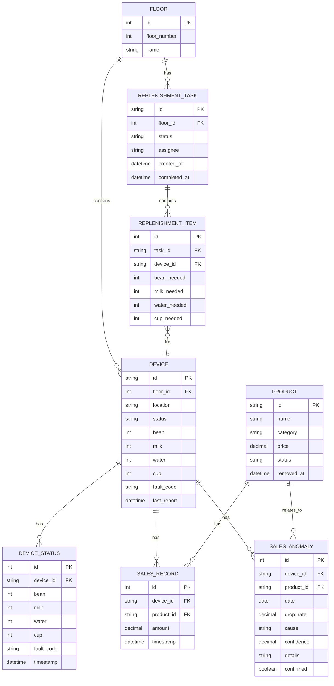

## 1. 架构设计



## 2. 技术描述

- **前端**: React@18 + TypeScript + Vite@5 + tailwindcss@3 + Zustand + Recharts
- **初始化工具**: vite-init
- **后端**: Node.js + Express@4 + TypeScript
- **数据库**: SQLite (better-sqlite3)
- **数据策略**: 内置完整的 mock 数据，包含多楼层设备、30天历史数据、多种异常场景

## 3. 路由定义

| 路由 | 页面 | 说明 |
|------|------|------|
| / | 仪表盘 | 设备状态、补货任务、销量趋势、异常告警 |
| /devices | 设备管理 | 设备列表、楼层筛选 |
| /devices/:id | 设备详情 | 历史数据、故障记录 |
| /replenishment | 补货管理 | 补货任务、执行记录 |
| /replenishment/tasks | 补货任务 | 按楼层补货清单 |
| /replenishment/history | 补货历史 | 补货记录查询 |
| /sales | 销量分析 | 销量趋势、异常检测 |
| /sales/anomalies | 异常分析 | 销量突降归因 |
| /products | 口味管理 | 产品列表、上下架 |
| /settings | 系统设置 | 楼宇配置、阈值设置 |

## 4. API 定义

```typescript
// 设备数据类型
interface Device {
  id: string;
  floor: number;
  location: string;
  status: 'online' | 'offline' | 'error';
  bean: number;      // 豆仓余量 0-100
  milk: number;      // 奶盒余量 0-100
  water: number;     // 水箱余量 0-100
  cup: number;       // 杯子余量 0-100
  faultCode: string | null;
  lastReport: string;
}

// 设备状态历史
interface DeviceStatus {
  id: string;
  deviceId: string;
  bean: number;
  milk: number;
  water: number;
  cup: number;
  faultCode: string | null;
  timestamp: string;
}

// 补货任务
interface ReplenishmentTask {
  id: string;
  floor: number;
  status: 'pending' | 'in_progress' | 'completed' | 'cancelled';
  items: ReplenishmentItem[];
  assignee: string;
  createdAt: string;
  completedAt: string | null;
}

interface ReplenishmentItem {
  deviceId: string;
  beanNeeded: number;
  milkNeeded: number;
  waterNeeded: number;
  cupNeeded: number;
}

// 销售记录
interface SalesRecord {
  id: string;
  deviceId: string;
  productId: string;
  amount: number;
  timestamp: string;
}

// 销量异常
interface SalesAnomaly {
  id: string;
  deviceId: string;
  date: string;
  dropRate: number;
  cause: 'out_of_stock' | 'machine_down' | 'product_removed' | 'unknown';
  confidence: number;
  details: string;
  confirmed: boolean;
}

// 产品（口味）
interface Product {
  id: string;
  name: string;
  category: string;
  price: number;
  status: 'active' | 'inactive';
  removedAt: string | null;
}
```

API 端点列表：
- `GET /api/devices` - 获取设备列表
- `GET /api/devices/:id` - 获取设备详情
- `GET /api/devices/:id/history` - 获取设备历史数据
- `GET /api/replenishment/tasks` - 获取补货任务
- `POST /api/replenishment/tasks/:id/complete` - 完成补货任务
- `GET /api/sales/trend` - 获取销量趋势
- `GET /api/sales/anomalies` - 获取销量异常列表
- `POST /api/sales/anomalies/:id/confirm` - 确认异常归因
- `GET /api/products` - 获取产品列表
- `PUT /api/products/:id/status` - 更新产品状态
- `GET /api/settings` - 获取系统设置
- `PUT /api/settings` - 更新系统设置

## 5. 服务器架构图



## 6. 数据模型

### 6.1 数据模型定义



### 6.2 数据定义语言

```sql
-- 楼层表
CREATE TABLE floor (
  id INTEGER PRIMARY KEY AUTOINCREMENT,
  floor_number INTEGER NOT NULL,
  name TEXT NOT NULL
);

-- 设备表
CREATE TABLE device (
  id TEXT PRIMARY KEY,
  floor_id INTEGER NOT NULL,
  location TEXT NOT NULL,
  status TEXT NOT NULL DEFAULT 'online',
  bean INTEGER NOT NULL DEFAULT 100,
  milk INTEGER NOT NULL DEFAULT 100,
  water INTEGER NOT NULL DEFAULT 100,
  cup INTEGER NOT NULL DEFAULT 100,
  fault_code TEXT,
  last_report DATETIME NOT NULL,
  FOREIGN KEY (floor_id) REFERENCES floor(id)
);

-- 设备状态历史表
CREATE TABLE device_status (
  id INTEGER PRIMARY KEY AUTOINCREMENT,
  device_id TEXT NOT NULL,
  bean INTEGER NOT NULL,
  milk INTEGER NOT NULL,
  water INTEGER NOT NULL,
  cup INTEGER NOT NULL,
  fault_code TEXT,
  timestamp DATETIME NOT NULL,
  FOREIGN KEY (device_id) REFERENCES device(id)
);

-- 补货任务表
CREATE TABLE replenishment_task (
  id TEXT PRIMARY KEY,
  floor_id INTEGER NOT NULL,
  status TEXT NOT NULL DEFAULT 'pending',
  assignee TEXT,
  created_at DATETIME NOT NULL,
  completed_at DATETIME,
  FOREIGN KEY (floor_id) REFERENCES floor(id)
);

-- 补货项目表
CREATE TABLE replenishment_item (
  id INTEGER PRIMARY KEY AUTOINCREMENT,
  task_id TEXT NOT NULL,
  device_id TEXT NOT NULL,
  bean_needed INTEGER NOT NULL DEFAULT 0,
  milk_needed INTEGER NOT NULL DEFAULT 0,
  water_needed INTEGER NOT NULL DEFAULT 0,
  cup_needed INTEGER NOT NULL DEFAULT 0,
  FOREIGN KEY (task_id) REFERENCES replenishment_task(id),
  FOREIGN KEY (device_id) REFERENCES device(id)
);

-- 产品表
CREATE TABLE product (
  id TEXT PRIMARY KEY,
  name TEXT NOT NULL,
  category TEXT NOT NULL,
  price DECIMAL(10,2) NOT NULL,
  status TEXT NOT NULL DEFAULT 'active',
  removed_at DATETIME
);

-- 销售记录表
CREATE TABLE sales_record (
  id INTEGER PRIMARY KEY AUTOINCREMENT,
  device_id TEXT NOT NULL,
  product_id TEXT NOT NULL,
  amount DECIMAL(10,2) NOT NULL,
  timestamp DATETIME NOT NULL,
  FOREIGN KEY (device_id) REFERENCES device(id),
  FOREIGN KEY (product_id) REFERENCES product(id)
);

-- 销量异常表
CREATE TABLE sales_anomaly (
  id INTEGER PRIMARY KEY AUTOINCREMENT,
  device_id TEXT NOT NULL,
  product_id TEXT,
  date DATE NOT NULL,
  drop_rate DECIMAL(5,2) NOT NULL,
  cause TEXT NOT NULL,
  confidence DECIMAL(5,2) NOT NULL,
  details TEXT,
  confirmed BOOLEAN NOT NULL DEFAULT 0,
  FOREIGN KEY (device_id) REFERENCES device(id),
  FOREIGN KEY (product_id) REFERENCES product(id)
);

-- 系统设置表
CREATE TABLE settings (
  key TEXT PRIMARY KEY,
  value TEXT NOT NULL
);

-- 索引
CREATE INDEX idx_device_floor ON device(floor_id);
CREATE INDEX idx_device_status_device ON device_status(device_id);
CREATE INDEX idx_device_status_timestamp ON device_status(timestamp);
CREATE INDEX idx_replenishment_task_floor ON replenishment_task(floor_id);
CREATE INDEX idx_sales_record_device ON sales_record(device_id);
CREATE INDEX idx_sales_record_product ON sales_record(product_id);
CREATE INDEX idx_sales_record_timestamp ON sales_record(timestamp);
CREATE INDEX idx_sales_anomaly_device ON sales_anomaly(device_id);
CREATE INDEX idx_sales_anomaly_date ON sales_anomaly(date);
```

## 7. 核心算法

### 7.1 补货需求计算

根据设备物料余量和预警阈值计算补货量：
- 低于预警阈值的物料需要补货
- 补货量 = 100 - 当前余量（补满）
- 按楼层聚合所有设备的补货需求

### 7.2 销量异常检测

滑动窗口算法：
- 计算设备过去7天日均销量作为基准
- 当日销量下降超过阈值（默认30%）即判定为异常
- 连续2天下降则提高告警级别

### 7.3 自动归因引擎

异常发生时，按优先级判断：
1. **停机**：检查同期设备是否有故障码或离线记录 → 判定为停机
2. **断货**：检查同期物料余量是否有低于5%的记录 → 判定为断货
3. **口味下架**：检查是否有产品在同期下架，且该产品占该设备销量比例 > 20% → 判定为口味下架
4. **未知**：以上都不满足则标记为未知，需人工确认
